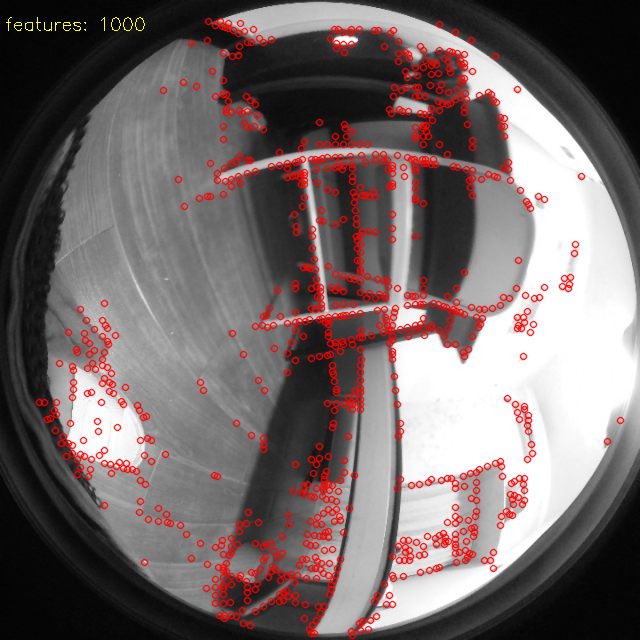

# xfeatc
Cpp port of [xfeat](https://github.com/verlab/accelerated_features).

## The original work
* https://github.com/verlab/accelerated_features/tree/main

## Features
* The pre&post processing steps have been carefully validated to make sure that the results align well with the original pytorch code.
* The InstanceNormalization layer has been moved from the model to pre-processing step
* The outputs have been changed from [B, C, H, W] to [B, H, W, C], which makes the post-processing much faster.
* Use FastExp instead of std::exp to speed up the softmax operation.

# Usage
### 1. Prepare onnxruntime.    
Download onnxruntime suitable for your system from [here](https://github.com/microsoft/onnxruntime/releases).
  (I used v1.18.0). And unzip it, and put it to somewhere you like, for example `D:/software/onnxruntime-win-x64-1.18.0`

### 2. Build
```bash
mkdir build && cd build
cmake .. -DONNXRUNTIME_ROOT=D:/software/onnxruntime-win-x64-1.18.0
make -j3
```

### 3. Run
You can directly run the `DetectDemo` and `MatchDemo`, the data has been prepared in the `data/` folder.


<mark> I have fixed the input image dimension to 1x1x640x640 when exporting the onnx model, so these demos can 
only support 640x640 gray images for now. Please use the attached python code to export your own onnx model if you want to support other image sizes.</mark>

# Export onnx
if you are interested in how to export onnx using pytorch, here is my code:

```python
import torch
from modules.xfeat import XFeatModel
import onnxruntime as ort

# os.environ['CUDA_VISIBLE_DEVICES'] = '' #Force CPU, comment for GPU

# set the model to evaluation mode
net = XFeatModel().eval()

# load the pretrained weights
net.load_state_dict(torch.load("weights/xfeat.pt", map_location=torch.device('cpu')))

# Random input
x = torch.randn(1, 1, 640, 640)

# export to ONNX
torch.onnx.export(net, x, "xfeat.onnx", verbose=True,
                  input_names=['input'],
                  output_names=['output_feats', "output_keypoints", "output_heatmap"],
                  opset_version=11)

print("ONNX model saved as xfeat.onnx")

# check the onnx model with onnxruntime
ort_session = ort.InferenceSession("xfeat.onnx")
print("ONNX model loaded successfully")

outputs = ort_session.run(None, {"input": x.numpy()})

# pytorch model outputs
torch_outputs = net(x)

# compare the outputs
for i in range(len(outputs)):
    print(f"onnx output shape {i}: {outputs[i].shape}")
    print(f"torch output shape {i}: {torch_outputs[i].shape}")
    print(f"Output {i} comparison: {torch.allclose(torch_outputs[i], torch.tensor(outputs[i]))}")
    print(f'Output {i} max diff: {torch.max(torch.abs(torch_outputs[i] - torch.tensor(outputs[i])))}')
    print("\n")

```

***please use [this fork](https://github.com/meyiao/accelerated_features/tree/main), since I have changed the output dimension order***

# License
Notice that the original XFeat code and the exported model is under Apache 2.0 license.   
[](https://github.com/verlab/accelerated_features/blob/main/LICENSE)

## Unlicense(for the c++ code of this repository)
This is free and unencumbered software released into the public domain.

Anyone is free to copy, modify, publish, use, compile, sell, or distribute this software, either in source code form or as a compiled binary, for any purpose, commercial or non-commercial, and by any means.

In jurisdictions that recognize copyright laws, the author or authors of this software dedicate any and all copyright interest in the software to the public domain. We make this dedication for the benefit of the public at large and to the detriment of our heirs and successors. We intend this dedication to be an overt act of relinquishment in perpetuity of all present and future rights to this software under copyright law.

THE SOFTWARE IS PROVIDED "AS IS", WITHOUT WARRANTY OF ANY KIND, EXPRESS OR IMPLIED, INCLUDING BUT NOT LIMITED TO THE WARRANTIES OF MERCHANTABILITY, FITNESS FOR A PARTICULAR PURPOSE AND NONINFRINGEMENT. IN NO EVENT SHALL THE AUTHORS BE LIABLE FOR ANY CLAIM, DAMAGES OR OTHER LIABILITY, WHETHER IN AN ACTION OF CONTRACT, TORT OR OTHERWISE, ARISING FROM, OUT OF OR IN CONNECTION WITH THE SOFTWARE OR THE USE OR OTHER DEALINGS IN THE SOFTWARE.

For more information, please refer to https://unlicense.org


